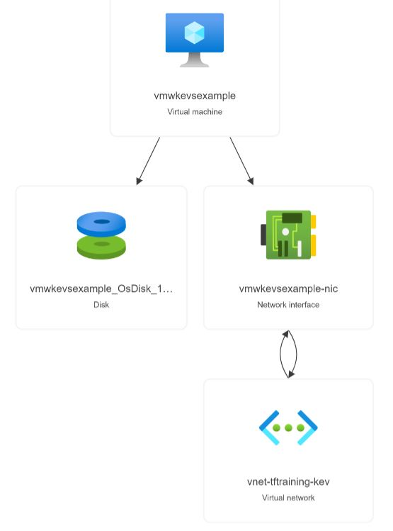
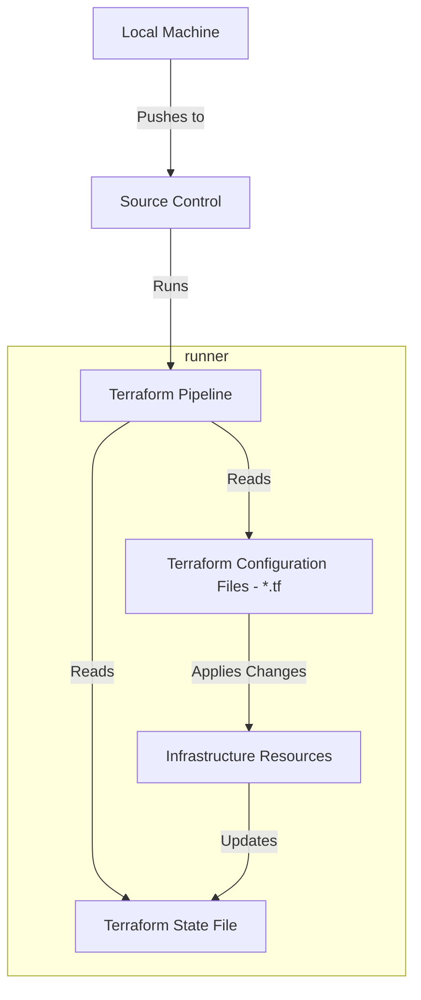

# Training Project

A basic template for use in Terraform training.

---
# Session 1 (2 hours)
## Exercise 1 - Create a Virtual Machine

In this exercise, you will create a virtual machine, and all the supporting Azure resources needed to build one.

1. Resource Group  - [azurerm_resource_group](https://registry.terraform.io/providers/hashicorp/azurerm/latest/docs/resources/resource_group)
2. Virtual Network - [azurerm_virtual_network](https://registry.terraform.io/providers/hashicorp/azurerm/latest/docs/resources/virtual_network)
3. Subnet - [azurerm_subnet](https://registry.terraform.io/providers/hashicorp/azurerm/latest/docs/resources/subnet)
4. Random Password - [random_password](https://registry.terraform.io/providers/hashicorp/random/latest/docs/resources/password)
5. Virtual Machine - [azurerm_windows_virtual_machine](https://registry.terraform.io/providers/hashicorp/azurerm/latest/docs/resources/windows_virtual_machine)




You will need the following settings within your code:
- Subscription ID: 2fd588c2-ba77-4dde-b8d0-d9093b711a6c
- Location: West Europe
- Vnet CIDR Range: 10.0.1.0/24
- Subnet CIDR Range: 10.0.1.0/28
- VM settings
  - size: Standard_B2s
  - publisher: MicrosoftWindowsServer
  - offer: WindowsServer
  - SKU: 2019-Datacenter
  - version: latest
- Tags
  - team: ccoe
  - servicename: training

---
## Exercise 2 - Terraform State

In this exercise, you will examine the terraform state file to get a better understanding of how Terraform knows what it has built.



---
## Exercise 3 - Using modules

In this exercise, you will learn about the modules that have been created by CCoE to make the provisioning of resources easier.

You will deploy a resource group and a key vault.

```terraform
source = "somerepo.com/tf-modules-local__default/resource-group/azurerm"
source = "somerepo.com/tf-modules-local__default/key-vault/azurerm"
```

[Modules - Artifactory](https://somerepo.com/ui/repos/tree/General/tf-modules-local)

[Modules - GitLab](https://somerepo.com/azure-migration/modules)

---
## Exercise 4 - Terraform Best Practices

We will discuss the Terraform best practices document, then review your code to see what changes are required to bring it in line with the recommendations (if any)

[Terraform Best Practices](https://somerepo.com/ccoe/best-practices/-/blob/main/docs/Terraform.Best.Practices.md)

---

# Session 2 (2 hours)

## Exercise 5 - Variables, locals, and outputs
This exercise will introduce the concept of variables, show you how to define them and assign values to them.
```terraform
variable "something" {
  type = string
  description = "an example variable"
  default = "squirrel"
}

something = "notasquirrel"
```

```terraform
locals {
  somelocal = join("-", ["astring", var.something])
}
```

```terraform
output "somethingelse" {
  value = azurerm_subnet.this.name
}
```
## Exercise 6 - Looping
This exercise will show you how to use for_each, and count meta arguments to create multiple copies of a resource. We will cover the use cases for both, and answer the eternal argument...which is better.

```terraform
resource "azurerm_subnet" "this" {
  for_each = var.subnets
  name = each.key
  address_prefixes = each.value.cidr
  ...
}
```

## Exercise 7 - GitLab and Pipelines
This exercise will introduce the basic concepts of branching, pushing to Gitlab, showing how pipelines run, merge requests, then tidying up your branches.


```bash
git checkout -b newbranch
git push -u origin newbranch
git branch -d newbranch
git remote prune origin
```

## Useful links

[Terraform.io](https://www.terraform.io/)

[Modules - Artifactory](https://somerepo.com/ui/repos/tree/General/tf-modules-local)

[Modules - GitLab](https://somerepo.com/azure-migration/modules)

[Terraform Best Practices](https://somerepo.com/ccoe/best-practices/-/blob/main/docs/Terraform.Best.Practices.md)

